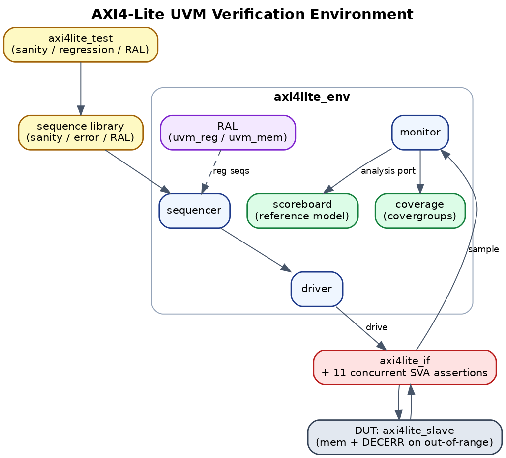
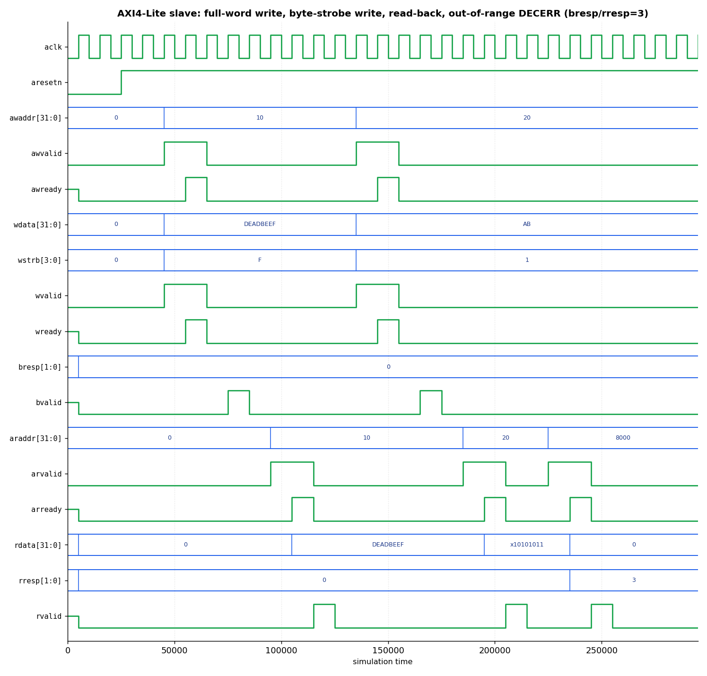
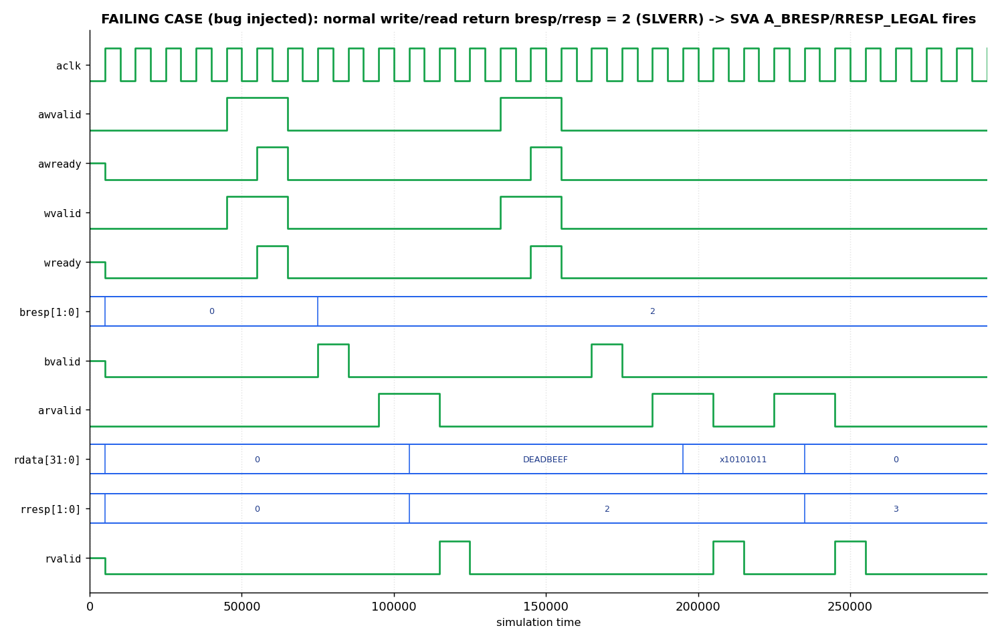

# AXI4-Lite UVM Verification Environment


A complete, industry-style **UVM** testbench verifying an AXI4-Lite slave with an
internal word-addressable memory. This is a real UVM environment — `uvm_env`,
`uvm_agent`, `uvm_sequencer`, `uvm_driver`, `uvm_monitor`, `uvm_scoreboard`
(reference-model based), a functional-coverage subscriber with **covergroups**,
a sequence library, and a **layer of concurrent SVA** bound to the interface.

## Architecture



```
                         +------------------- axi4lite_env --------------------+
                         |                                                     |
  axi4lite_sequence(s) --+--> sequencer --> driver --> [ AXI4-Lite IF ] --> DUT (axi4lite_slave)
                         |                                   |  |                       |
                         |                                monitor <--------------------+
                         |                                   | (analysis port)         
                         |                  +----------------+----------------+        
                         |                  v                                 v        
                         |            scoreboard (reference model)      coverage (covergroups)
                         +-----------------------------------------------------+
   SVA assertions are bound inside axi4lite_if (handshake stability, no-X,
   OKAY response, bounded write/read completion).
```

## Waveform (real simulation output)



Captured from an actual simulation of the DUT (`axi4lite_slave`) driven through a
full-word write, a byte-strobe write, read-backs, and an **out-of-range access that
returns DECERR** (`bresp`/`rresp` = `2'b11`). Generated from the simulator's VCD —
the same signals the **11 concurrent SVA assertions** monitor (handshake stability,
no-X on address/data/strobe, legal response codes, bounded completion).

**Failing case (bug injected).** With `+define+INJECT_BRESP_ERR`, the slave returns
`SLVERR` (`bresp`/`rresp` = `2`) on a normal access — the bound assertions
`A_BRESP_LEGAL` / `A_RRESP_LEGAL` and the scoreboard catch it:



## File map

| File | Role |
|---|---|
| `rtl/axi4lite_slave.sv` | DUT: AXI4-Lite slave, 256 x 32-bit memory, byte strobes, OKAY responses |
| `tb/axi4lite_if.sv` | Interface, clocking blocks, **bound SVA protocol assertions** |
| `tb/axi4lite_seq_item.sv` | Transaction with `rand` fields + `constraint` blocks |
| `tb/axi4lite_sequences.sv` | write-read, constrained-random, and directed-corner sequences |
| `tb/axi4lite_driver.sv` | Drives AXI4-Lite handshakes from transactions |
| `tb/axi4lite_monitor.sv` | Reconstructs completed transactions, analysis port |
| `tb/axi4lite_scoreboard.sv` | Reference-model memory; checks every read |
| `tb/axi4lite_coverage.sv` | `covergroup`: op, address range, strobe, op×range cross |
| `tb/axi4lite_agent.sv` / `axi4lite_env.sv` | agent + env wiring |
| `tb/axi4lite_test.sv` | `sanity` and `regression` tests |
| `tb/axi4lite_pkg.sv` | package include order |
| `tb/tb_top.sv` | clock/reset, DUT+IF, `run_test` |
| `sim/Makefile`, `sim/run.f` | run for Questa / VCS / Xcelium |

## How to run

UVM + concurrent SVA + covergroups require a **UVM-capable simulator**
(Questa, VCS, or Xcelium). Two easy paths:

### Option A — EDA Playground (free, no install)
1. Go to edaplayground.com, sign in.
2. Left pane: **UVM/OVM → UVM 1.2**, Simulator: **Mentor Questa** (or Aldec Riviera).
3. Tick **Open EPWave after run** for waveforms.
4. Paste each `tb/*.sv` + `rtl/axi4lite_slave.sv` into design/testbench panes
   (or use the multiple-files layout), set the top to `tb_top`.
5. Run. Pick a test with the plusarg `+UVM_TESTNAME=axi4lite_regression_test`.

### Option B — local simulator
```bash
cd sim
make questa TEST=axi4lite_regression_test     # ModelSim/Questa
# or
make vcs    TEST=axi4lite_regression_test     # Synopsys VCS
# or
make xrun   TEST=axi4lite_regression_test     # Cadence Xcelium
```

Tests:
- `axi4lite_sanity_test` — 10 directed write/read pairs (smoke test).
- `axi4lite_regression_test` — directed corners + 16 write/read pairs + 40 random
  transactions (default; drives coverage up).

## Expected result (regression test)

```
UVM_INFO ... [SCB] ============ SCOREBOARD SUMMARY ============
UVM_INFO ... [SCB] writes=.. reads=.. MATCH=.. MISMATCH=0 RESP_MISMATCH=0
UVM_INFO ... [SCB] RESULT: PASS
UVM_INFO ... [COV] Functional coverage = 100.00%
UVM_INFO ... [TEST_DONE] ... UVM_ERROR :    0  UVM_FATAL :    0
```
(Exact counts vary with the random seed; MISMATCH and RESP_MISMATCH must be 0, and
coverage reaches 100% of the defined coverpoints with the regression test.)

## Error-path verification (DECERR)

Beyond happy-path data checking, the environment verifies the **decode-error path**:
- The slave returns **DECERR** (`2'b11`) for any out-of-range access (`addr >= 0x400`)
  and leaves memory untouched.
- The transaction has an `oob` knob; `axi4lite_error_seq` drives directed + randomized
  out-of-range writes and reads.
- The scoreboard **predicts the response from the address** (in-range → OKAY,
  out-of-range → DECERR), checks it, and only updates/compares the data model on OKAY.
- Coverage adds a `decerr` response bin and an `oob` address bin (both closed by the
  error sequence); the SVA `A_BRESP_LEGAL`/`A_RRESP_LEGAL` allow only OKAY/DECERR.

This shows response-channel verification and reference-model prediction, not just
data integrity — a step up in DV maturity.

## Bug Injection & Debug Story (the part interviewers care about)

A testbench is only as good as the bugs it catches. This DUT has a **deliberate,
toggleable bug** so the environment can prove it finds real RTL defects.

**Enable the bug** by compiling with `+define+INJECT_WSTRB_BUG` (Questa:
`vlog -sv +define+INJECT_WSTRB_BUG ...`; EDA Playground: add it to the compile args).

**What the bug is:** the write path ignores `WSTRB` and writes the full 32-bit word
on every write. A partial-strobe write (e.g. `WSTRB=0x1`) should update only byte 0
and leave the other three bytes intact.

**How the TB catches it:** the directed sequence writes `0xFFFFFFFF` to `0x20`, then
writes `0x000000AA` with `WSTRB=0x1`. The reference-model scoreboard (which honors
strobes) predicts `0xFFFFFFAA`. The buggy DUT stores `0x000000AA`, so the read-back
fails:

```
UVM_ERROR ... [SCB] READ MISMATCH addr=0x00000020 expected=0xFFFFFFAA got=0x000000AA
UVM_INFO  ... [SCB] RESULT: FAIL
```

**Debug walk-through (say this in an interview):** mismatch on a partial-strobe write
→ compare expected vs actual byte-by-byte → only the strobed byte is correct, the
others are wrong → points straight at WSTRB handling in the write path → confirmed by
re-running without the define (PASS). This is the loop: *reproduce → localize from the
scoreboard diff → form a hypothesis → confirm.*

Run **without** the define = clean PASS. Run **with** it = the scoreboard catches the
bug on the exact transaction. That contrast is the artifact to screenshot.

**Second injectable bug — protocol error (assertion catch):** compile with
`+define+INJECT_BRESP_ERR` and the slave returns **SLVERR** on a normal read/write.
The bound concurrent assertions `A_BRESP_OKAY` / `A_RRESP_OKAY` fire immediately:
```
"[SVA] BRESP not OKAY"
```
This shows the **assertion layer** (not just the scoreboard) catching an illegal
protocol response — two independent checking mechanisms, two classes of bug caught.

## Coverage closure

The `axi4lite_regression_test` is built to **close 100% of the defined functional
coverage**: directed corners + 16 write/read pairs + 40 constrained-random transactions
hit every bin in `cg_axi` — operation (read/write), address range (low/mid/high),
byte-strobe (full/single/other), and the operation × address-range cross.

Read the closure number from the report:
```
UVM_INFO ... [COV] Functional coverage = 100.00%
```
If a bin is unhit, that's the signal to write a targeted directed test for it — the
core coverage-driven-verification loop. Capture the coverage report (Questa: `coverage
report -detail`) as proof.

## What this demonstrates (for interviews)
- Full UVM component hierarchy and phasing.
- Constrained-random stimulus with `constraint` blocks and `randomize() with`.
- Reference-model scoreboard (self-checking, not just log-watching).
- Functional coverage with `covergroup`/`coverpoint`/`cross` and coverage reporting.
- Assertion-based verification (concurrent SVA) for protocol legality.
- Reusable agent and a layered sequence library.

## Roadmap — top-tier extensions (planned)
The next upgrades that push this from strong to top-tier:
- ✅ **DECERR error-path feature** — DONE (out-of-range → DECERR, error sequence,
  scoreboard response-prediction, resp/oob coverage, legal-response SVA).
- ✅ **RAL** — DONE (`uvm_reg_block` + `uvm_mem` + `uvm_reg_adapter` in
  `tb/axi4lite_ral.sv`; run `+UVM_TESTNAME=axi4lite_ral_test`).
- **Random back-pressure** — wait-states on AWREADY/WREADY/ARREADY + outstanding/
  interleaved transactions.
- **Gate-level / FPGA** smoke of the DUT.

## Notes / honesty
- Tested against UVM 1.2 semantics. First compile on a new tool version may need
  trivial tweaks (e.g., `+define`s); the methodology and structure are the point.
- Two injectable bugs are included (`INJECT_WSTRB_BUG` = data, `INJECT_BRESP_ERR` =
  protocol) to demonstrate the scoreboard and the SVA layer each catching defects.
```
